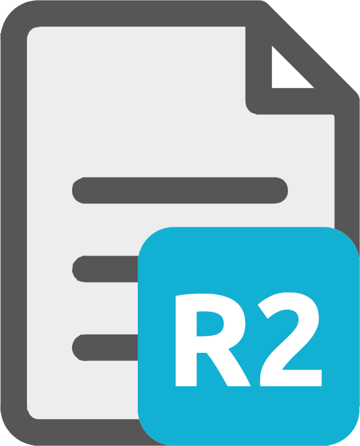

<div align="center">
  
  <br>
  <h1>Template Picker</h1>
  A VScode Extension to pick <a style="color:#00B1D2">Templates</a>.
</div>

This extension allows you to:

- See all available templates in the [Marketplace](https://r2devops.io/marketplace/)
- Search for specific templates by name
- Check the details of a template: Documentation, GitLab CI file, etc.
- Pick a specific template's version and add it to your `.gitlab-ci.yml` file

## Features

This extension provides show the Marketplace in the side panel, when you have a `.gitlab-ci.yml` file opened. You can control this behavior with in the [Extension Settings](#extension-settings).

Also, an editor icon will appear in the top right corner of the editor. Click on it to open the Marketplace.
You can also access it with the shortcut `Ctrl+Shift+P` or `Cmd+Shift+P` on Mac.

Once the Marketplace is opened, you can:

### See all available templates in the [Marketplace](https://r2devops.io/marketplace/)

You can see all available templates in the Marketplace. By default the URL of the marketplace is based on`https://api.r2devops.io`. You can change it to your own API URL if you want to use your own templates. Check the [Extension Settings](#extension-settings) section for more information.

### Search for specific templates by name

Need a specific template? Search for it by name and pick the one you want.


### Check the details of a template

You can check the details of a template:

- Read the documentation
- See the GitLab CI file
- Check details and information about the template
- Show the changelog

### Pick a specific template's version and add it to your `.gitlab-ci.yml` file

You can select for a specific version by choosing one in the list. Once you have selected a version, you can add it to your `.gitlab-ci.yml` file.

## Extension Settings

`API_URL`: The URL of the API to use. Defaults to `https://api.r2devops.io`. You can change it to your own API URL if you want to use your own templates.

`Show_panel_gitlab_file_open` : Show the panel when a `.gitlab-ci.yml` file is opened. Defaults to `true`.

## Requirements

This extension requires the following:
- `VScode` version `1.46.0` or higher

## Running the extension

To run the extension locally, run the following commands:

```bash
# Install all dependencies
npm run install:all

# Build the Webview UI
npm run build:webview

# Open sample in VS Code
code .
```

You can then run the extension by pressing `F5` to open a new Extension Development Host window. This extension is inspired on the [Hello World (React + Create React App)](https://github.com/microsoft/vscode-webview-ui-toolkit-samples/tree/main/default/hello-world) sample extension. You can check the [Webview](./webview-ui/README.md) folder to see how the extension works.

## Contributing

This extension is open source and hosted on [GitLab](https://gitlab.com/r2devops/template-picker). Contributions are more than welcome. Feel free to fork and add new features or submit bug reports. See [CONTRIBUTING](./CONTRIBUTING.md) for more information.

## License

This project is licensed under the [MIT License](./LICENSE).

